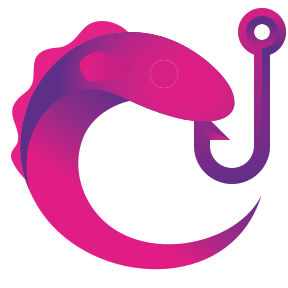

<h1>RsJS Use Hooks</h1>

Simple-to-use React Hooks for RxJS interop.

**Visit [https://crutchcorn.github.io/rxjs-use-hooks](https://crutchcorn.github.io/rxjs-use-hooks/) to get started with `rxjs-use-hooks`.**

## Contributing

If you've ever wanted to contribute to open source, now is your chance!

See the [contributing docs](./CONTRIBUTING.md) for more information
